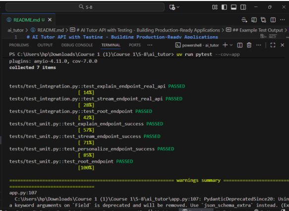
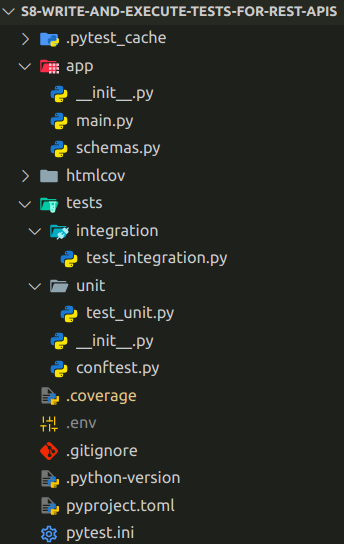

## Study Buddy - Test and Validate Your Personalised AI Tutor REST API

This practice is a perfect introduction to Agentic AI Testing. We add comprehensive testing to the REST API from previous practice - `Study Buddy - Convert Personalised AI Tutor with REST API `. It implements unit tests with mocks and integration tests with real API calls to achieve near-complete code coverage.

----

### Problem Statement

Build a comprehensive test suite for your AI Tutor REST API using pytest.Implement unit tests for individual functions and integration tests for API endpoints. ​

Mock external LLM calls, measure code coverage with pytest-cov, and ensure your API is production-ready through automated testing.

---

#### Context

Your AI Tutor API now serves multiple learners with streaming responses and rate limiting. Before deploying to production, you need confidence that endpoints handle errors gracefully, LLM failures don't crash the system, and rate limits work correctly
under load.​

Implement automated testing with pytest to verify endpoint behavior, mock external LLM calls to test without API costs, and measure code coverage to identify untested edge cases—ensuring your API is reliable and production-ready.

---
#### Task Details

Following steps should be performed to build the solution for this practice. 

### Step 1: Configure Testing Environment​

- Install `pytest`, `pytest-cov`, and `httpx` for testing.​
- Set up a `tests/` directory in your project folder.​
- Create a `pytest.ini` file to configure test markers for unit and integration tests.​

### Step 2: Write Unit Tests (Fast & Isolated)​

- Write unit tests that validate individual functions without calling real APIs.​
- Use mock objects to simulate Gemini API responses.​
- Verify logic such as status codes, response structures, and ​validation errors.​
- Tag all unit tests using `@pytest.mark.unit`.​

### Step 3: Write Integration Tests (End-to-End)​

- Use FastAPI’s `TestClient` to send real HTTP requests to your API.​
- Test complete workflows like`/explain`, `/stream`, and `/personalize` endpoints.​
- Ensure correct responses, proper error handling, and API status codes.​
- Tag all integration tests using `@pytest.mark.integration`.

### Step 4: Measure Code Coverage(Optional)​

- Run tests with coverage reporting: `pytest --cov=app --cov-report=html​`
- Review `htmlcov/index.html` to see which lines of code are covered or missed.​
- Aim for 80%+ coverage to ensure production readiness.

#### Note
**Copy the previous sprint - "Develop and Document Rest API Endpoints" exercise solution into the cloned repository to solve this exercise.**

----

#### Expected Program Behavior

When the program runs:​

- Running `pytest` executes all tests and reports results (PASS / FAIL).​
- Unit tests run instantly and verify core logic without real API calls.​
- Integration tests validate real API workflows and response correctness.​
- The project produces a coverage report showing tested and untested code.​
- Developers can run tests confidently before deployment, ensuring every update maintains system stability.

----

### 💡 Expected Output Reference

-----

### Project Structure

-----